# 🤝 Contributing to Flutter Theme Generator

<div align="center">


**Welcome to our contributor community!** 🎉 
*Your contributions make Flutter development better for everyone*

[](https://github.com/mukhbit0/Flutter-Theme-Generator/graphs/contributors)
[](https://github.com/mukhbit0/Flutter-Theme-Generator/pulls)
[](https://github.com/mukhbit0/Flutter-Theme-Generator/issues?q=is%3Aissue+is%3Aopen+label%3A%22good+first+issue%22)

</div>

---

## 🌟 Why Contribute?

<table>
<tr>
<td width="50%">

### 🚀 **Impact Thousands of Developers**
Your contributions directly help Flutter developers worldwide create beautiful apps faster and easier.

### 💡 **Learn & Grow**  
Work with modern technologies, improve your skills, and learn from experienced developers.

### 🏆 **Build Your Portfolio**
Showcase your contributions to a popular open-source project used by developers globally.

</td>
<td width="50%">

### 🤝 **Join Our Community**
Connect with like-minded developers, share knowledge, and collaborate on exciting features.

### 🎯 **Shape the Future**
Help guide the direction of Flutter theme development tools and influence what gets built next.

### 🌈 **Make Development Fun**
Contribute to tools that make coding more enjoyable and accessible for everyone.

</td>
</tr>
</table>

---

## 🎯 Ways to Contribute

<div align="center">

### Choose Your Adventure! 

</div>

| 🐛 **Bug Reports** | ✨ **Feature Requests** | 📝 **Documentation** | 🎨 **UI/UX Improvements** |
|:------------------:|:----------------------:|:--------------------:|:-------------------------:|
| Found something broken? Help us fix it! | Have a great idea? Share it with us! | Make our docs clearer and more helpful | Enhance the user experience |
| [Report Bug](https://github.com/mukhbit0/Flutter-Theme-Generator/issues/new?template=bug_report.md) | [Request Feature](https://github.com/mukhbit0/Flutter-Theme-Generator/issues/new?template=feature_request.md) | [Improve Docs](https://github.com/mukhbit0/Flutter-Theme-Generator/tree/main/docs) | [Enhance UI](https://github.com/mukhbit0/Flutter-Theme-Generator/issues?q=is%3Aopen+is%3Aissue+label%3Aui%2Fux) |

<details>
<summary><b>🔍 More Ways to Help</b></summary>

- **🧪 Testing**: Try new features and report issues
- **🎓 Tutorials**: Create guides and tutorials for other developers  
- **🌐 Translations**: Help make the tool accessible in more languages
- **⚡ Performance**: Optimize code for better speed and efficiency
- **🔧 DevOps**: Improve build processes and deployment workflows
- **📊 Analytics**: Add insights to help users make better theme choices

</details>

---

## 🚀 Quick Start for Contributors

<div align="center">

### Get Up and Running in 5 Minutes!

</div>

<table>
<tr>
<td width="50%">

### 1️⃣ **Fork & Clone**
```bash
# Fork on GitHub, then clone your fork
git clone https://github.com/mukhbit0/Flutter-Theme-Generator.git
cd Flutter-Theme-Generator
```

### 2️⃣ **Install Dependencies**
```bash
# Install all project dependencies  
npm install

# Start development server
npm run dev
```

</td>
<td width="50%">

### 3️⃣ **Create Your Branch**
```bash
# Create a descriptive branch name
git checkout -b feature/awesome-new-feature
# or
git checkout -b fix/bug-description
```

### 4️⃣ **Start Coding!**
```bash
# Make your changes and test locally
npm run dev       # Development server
npm run lint      # Check code quality  
npm run build     # Test production build
```

</td>
</tr>
</table>

---

## 📋 Development Workflow

<div align="center">

### Follow Our Proven Process

```mermaid
flowchart TD
    A[🍴 Fork Repository] --> B[📥 Clone Your Fork]
    B --> C[🌿 Create Feature Branch]
    C --> D[💻 Make Changes]
    D --> E[🧪 Test Locally]
    E --> F{✅ All Tests Pass?}
    F -->|No| D
    F -->|Yes| G[📝 Commit Changes]
    G --> H[🚀 Push to Your Fork]
    H --> I[🔄 Create Pull Request]
    I --> J[👀 Code Review]
    J --> K{💯 Approved?}
    K -->|Changes Needed| D
    K -->|Yes| L[🎉 Merged!]
```

</div>



### 📝 **Detailed Steps**

<details>
<summary><b>1. 🍴 Fork the Repository</b></summary>

1. Visit the [Flutter Theme Generator repository](https://github.com/mukhbit0/Flutter-Theme-Generator)
2. Click the **Fork** button in the top-right corner
3. Select your GitHub account as the destination

</details>

<details>
<summary><b>2. 📥 Clone Your Fork</b></summary>

```bash

git clone https://github.com/mukhbit0/Flutter-Theme-Generator.git
cd Flutter-Theme-Generator

# Add the original repository as upstream
git remote add upstream https://github.com/mukhbit0/Flutter-Theme-Generator.git
```

</details>

<details>
<summary><b>3. 🌿 Create a Feature Branch</b></summary>

```bash
# Always create a new branch for your changes
git checkout -b feature/your-feature-name

# Good branch naming examples:
# feature/color-picker-enhancement
# fix/dark-mode-toggle-bug  
# docs/installation-guide
# ui/responsive-mobile-layout
```

</details>

<details>
<summary><b>4. 💻 Make Your Changes</b></summary>

- **Keep changes focused**: One feature or fix per pull request
- **Follow existing code style**: Use our linting rules and patterns
- **Write meaningful commit messages**: Explain what and why, not just what
- **Test your changes**: Ensure everything works as expected

</details>

<details>
<summary><b>5. 🧪 Test Your Changes</b></summary>

```bash
# Run the development server
npm run dev

# Check for linting errors  
npm run lint

# Run type checking
npm run type-check

# Build to ensure no production issues
npm run build
```

</details>

<details>
<summary><b>6. 📝 Commit Your Changes</b></summary>

```bash
# Stage your changes
git add .

# Write a clear, descriptive commit message
git commit -m "feat: add color contrast checker for accessibility"

# Follow conventional commit format:
# feat: new feature
# fix: bug fix  
# docs: documentation changes
# style: formatting changes
# refactor: code refactoring
# test: adding tests
# chore: maintenance tasks
```

</details>

<details>
<summary><b>7. 🚀 Push and Create Pull Request</b></summary>

```bash
# Push your branch to your fork
git push origin feature/your-feature-name
```

Then visit GitHub to create a pull request with:
- **Clear title** describing what you've done
- **Detailed description** explaining the changes and why
- **Screenshots** for UI changes (before/after)
- **Testing instructions** for reviewers

</details>

---

## 🎨 Code Style Guidelines

<div align="center">

### Keep Our Code Beautiful and Consistent

</div>

<table>
<tr>
<td width="50%">

### 📏 **Formatting Rules**
- **Indentation**: 2 spaces (no tabs)
- **Line length**: Maximum 100 characters  
- **Semicolons**: Required in TypeScript
- **Quotes**: Single quotes for strings
- **Trailing commas**: Always include them

### 🏗️ **File Structure**
```
src/
├── components/        # Reusable UI components
├── hooks/            # Custom React hooks  
├── utils/            # Helper functions
├── types/            # TypeScript type definitions
└── styles/           # Global styles and themes
```

</td>
<td width="50%">

### 📝 **Naming Conventions**
- **Components**: PascalCase (`ColorPicker.tsx`)
- **Files**: kebab-case (`theme-generator.ts`)  
- **Variables**: camelCase (`primaryColor`)
- **Constants**: UPPER_SNAKE_CASE (`MAX_FILE_SIZE`)
- **CSS Classes**: Tailwind utilities preferred

### 🧪 **Testing Standards**  
- Write tests for new features
- Update tests when changing functionality
- Aim for meaningful test descriptions
- Include edge cases and error scenarios

</td>
</tr>
</table>

### ✅ **Code Quality Checklist**

Before submitting your pull request, ensure:

- [ ] **Linting passes**: `npm run lint` shows no errors
- [ ] **TypeScript compiles**: `npm run type-check` succeeds  
- [ ] **Build succeeds**: `npm run build` completes without errors
- [ ] **Manual testing**: Your changes work as expected
- [ ] **Responsive design**: UI works on mobile and desktop
- [ ] **Accessibility**: Proper ARIA labels and keyboard navigation
- [ ] **Performance**: No unnecessary re-renders or heavy computations

---

## 🐛 Bug Reports

<div align="center">

### Help Us Squash Bugs Effectively!

</div>

<table>
<tr>
<td width="50%">

### 🔍 **Before Reporting**
1. **Search existing issues** to avoid duplicates
2. **Update to latest version** and test again  
3. **Try in a different browser** to isolate the issue
4. **Check console errors** for technical details

### 📝 **What to Include**
- **Clear title** summarizing the bug
- **Steps to reproduce** the issue
- **Expected vs actual behavior**
- **Screenshots or videos** if visual
- **Browser and OS information**
- **Console error messages**

</td>
<td width="50%">

### 🏷️ **Bug Report Template**

```markdown
## 🐛 Bug Description
Brief description of what went wrong

## 🔄 Steps to Reproduce  
1. Go to theme generator
2. Upload a logo file
3. Click on color picker
4. Bug occurs here

## ✅ Expected Behavior
What should have happened

## ❌ Actual Behavior  
What actually happened

## 🖼️ Screenshots
Add screenshots if applicable

## 💻 Environment
- Browser: Chrome 118
- OS: macOS 13.5
- Device: Desktop
```

</td>
</tr>
</table>

**📋 [Use Our Bug Report Template](https://github.com/mukhbit0/Flutter-Theme-Generator/issues/new?template=bug_report.md)**

---

## ✨ Feature Requests

<div align="center">

### Share Your Ideas to Make the Tool Even Better!

</div>

<table>
<tr>
<td width="50%">

### 💡 **Great Feature Ideas Include**
- **Clear problem statement**: What pain point does this solve?
- **Proposed solution**: How would you implement it?  
- **User benefit**: Who would use this and why?
- **Examples**: Similar features in other tools
- **Implementation notes**: Technical considerations

### 🎯 **Feature Priorities**
We focus on features that:
- **Solve common problems** for Flutter developers
- **Align with Material Design** principles
- **Improve accessibility** and usability  
- **Have broad appeal** across different use cases
- **Are technically feasible** with our current stack

</td>
<td width="50%">

### 📋 **Feature Request Template**

```markdown
## 🚀 Feature Description
Clear summary of the proposed feature

## 🎯 Problem Statement
What problem does this solve?

## 💡 Proposed Solution  
How would this feature work?

## 🌟 Benefits
- Who would benefit?
- How would it improve the tool?
- What use cases would it enable?

## 🎨 Mockups/Examples
Screenshots or wireframes if applicable

## 🔧 Technical Considerations
Any implementation thoughts?
```

</td>
</tr>
</table>

**🎯 [Submit a Feature Request](https://github.com/mukhbit0/Flutter-Theme-Generator/issues/new?template=feature_request.md)**

---

## 📖 Documentation Contributions

<div align="center">

### Help Make Our Documentation World-Class!

</div>

<table>
<tr>
<td width="50%">

### 📚 **Documentation Needs**
- **Getting started guides** for new users
- **Advanced tutorials** for power users
- **API documentation** for developers  
- **Troubleshooting guides** for common issues
- **Video tutorials** and examples
- **Accessibility guidelines**

### ✍️ **Writing Style**
- **Clear and concise** language
- **Step-by-step instructions** with screenshots
- **Real-world examples** and use cases
- **Consistent formatting** and structure
- **Beginner-friendly** explanations

</td>
<td width="50%">

### 🗂️ **Documentation Structure**

```
docs/
├── getting-started/     # Installation and setup
├── tutorials/           # Step-by-step guides  
├── api/                # Technical reference
├── troubleshooting/    # Common issues
├── contributing/       # This guide!
└── examples/           # Sample projects
```

### 🔍 **Documentation Checklist**
- [ ] Clear headings and structure
- [ ] Screenshots for visual steps
- [ ] Code examples that work
- [ ] Links to related sections  
- [ ] Updated table of contents
- [ ] Spell-checked and proofread

</td>
</tr>
</table>

---

##