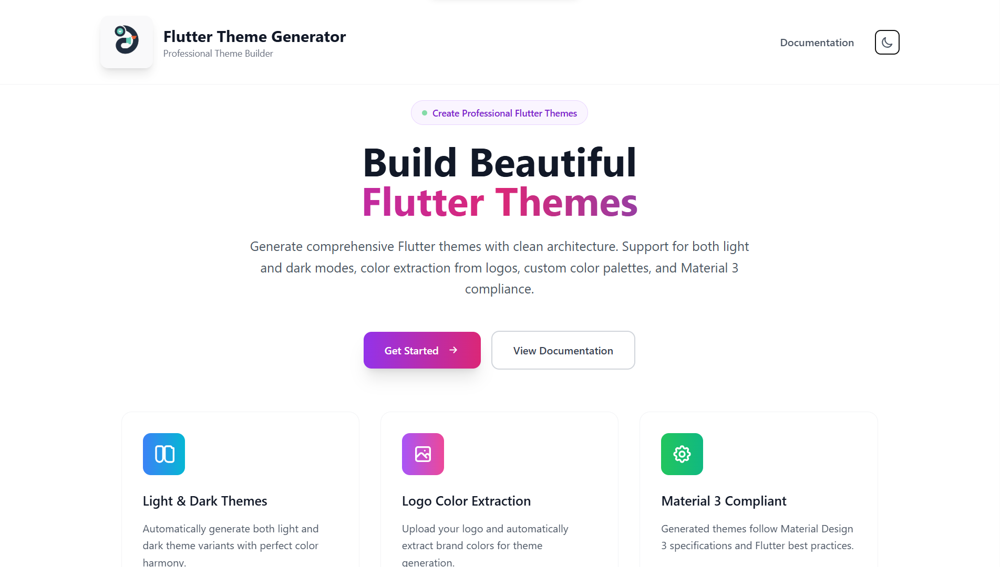
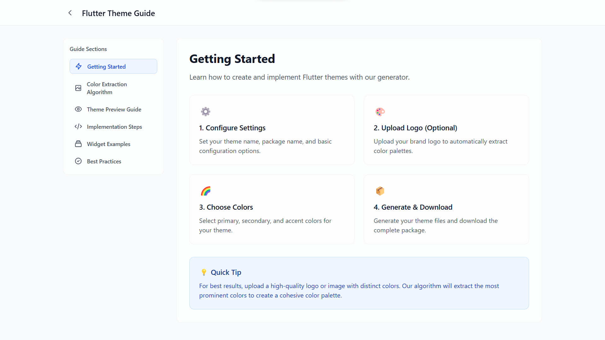
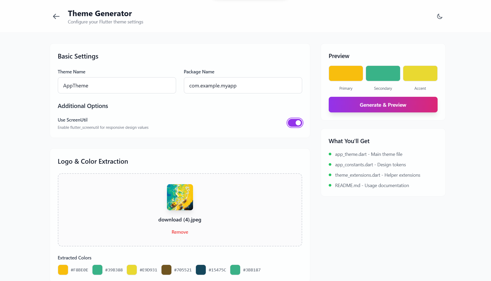
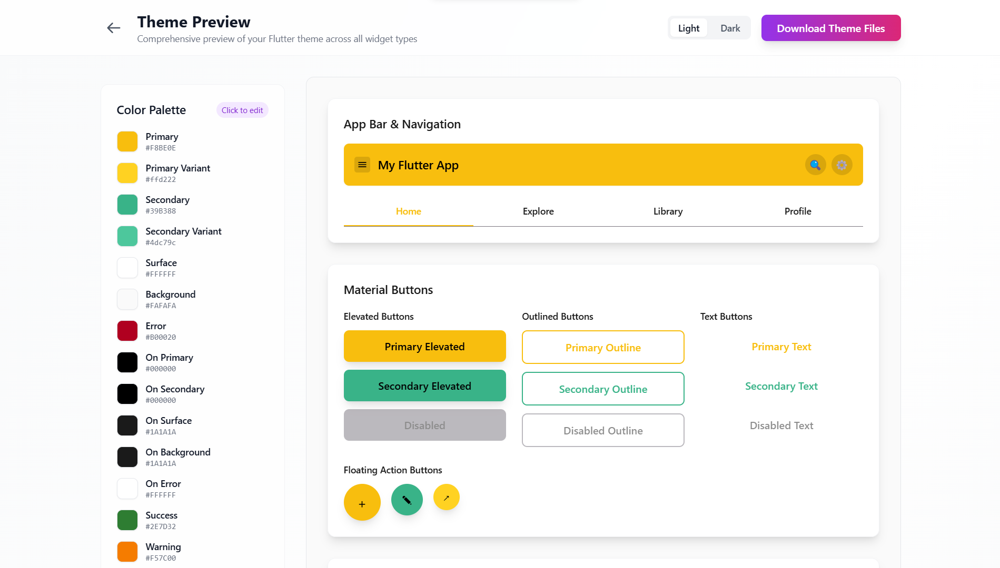

# ✨ Flutter Theme Generator



A professional, modern, and easy-to-use web app for generating beautiful Flutter themes with advanced color extraction, Material 3 support, and live widget previews.

---

## 🚀 Features

- 🎨 **Material 3 & Dark Mode**: Generate light/dark themes with Material Design 3 compliance.
- 🖼️ **Logo Color Extraction**: Upload a logo and auto-extract brand colors.
- 🧩 **Live Widget Previews**: See your theme on real Flutter widgets instantly.
- ⚡ **Custom Colors & Settings**: Fine-tune every color, spacing, typography, and more.
- 📦 **One-Click Export**: Download a ready-to-use Flutter theme package.
- 🛠️ **No Login Required**: 100% free and privacy-friendly.

---

## 🖼️ Screenshots





---

## 📝 How It Works

1. **Upload your logo** (optional) to extract brand colors.
2. **Adjust base colors, typography, and settings** in the sidebar.
3. **Preview your theme** on a full set of Flutter widgets.
4. **Export** your theme as a ZIP package with Dart files and documentation.

---

## 📂 Project Structure

```
├── public/                # Static assets (favicon, logo, etc.)
├── src/
│   ├── components/        # React UI components
│   ├── contexts/          # Theme and dark mode context
│   ├── generators/        # Dart code generators
│   ├── services/          # Utility services (e.g., ZipService)
│   ├── types/             # TypeScript types
│   └── utils/             # Color extraction, file download, etc.
├── dist/                  # Production build output
├── index.html             # App entry point
├── vite.config.ts         # Vite build config
├── wrangler.toml          # Cloudflare Workers config
└── ...
```

---

## 🌐 Deployment

This app is designed for Cloudflare Workers. To deploy:

1. **Build the app:**
   ```sh
   npm run build
   ```
2. **Deploy to Cloudflare Workers:**
   ```sh
   npx wrangler deploy --env production
   ```

---

## 🤝 Contributing

Pull requests and issues are welcome! See [CONTRIBUTING.md](CONTRIBUTING.md).

---

## 📄 License

MIT. See [LICENSE](LICENSE).

---

## 🙏 Credits

Created by [Ionic Errrrs Code](https://github.com/mukhbit0) with ❤️

---